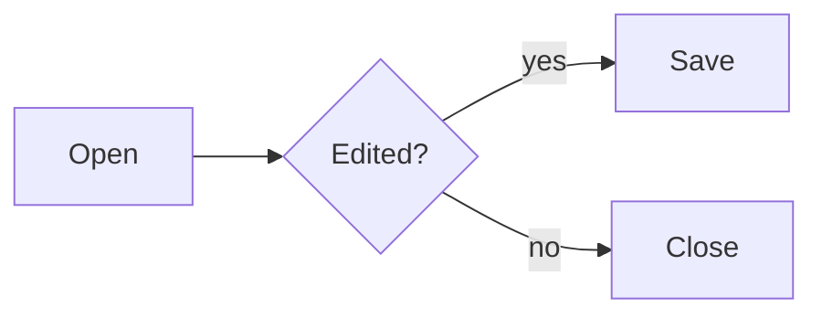

# Emoji and diagrams

Shortcodes :tada: :+1: :white_check_mark: and literal emoji 🎉 👍.

```mermaid
graph LR
  A[Open] --> B{Edited?}
  B -- yes --> C[Save]
  B -- no --> D[Close]
```

@mention and #123 issue references are plain text in a file.
